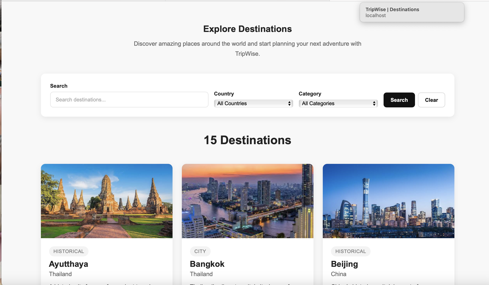
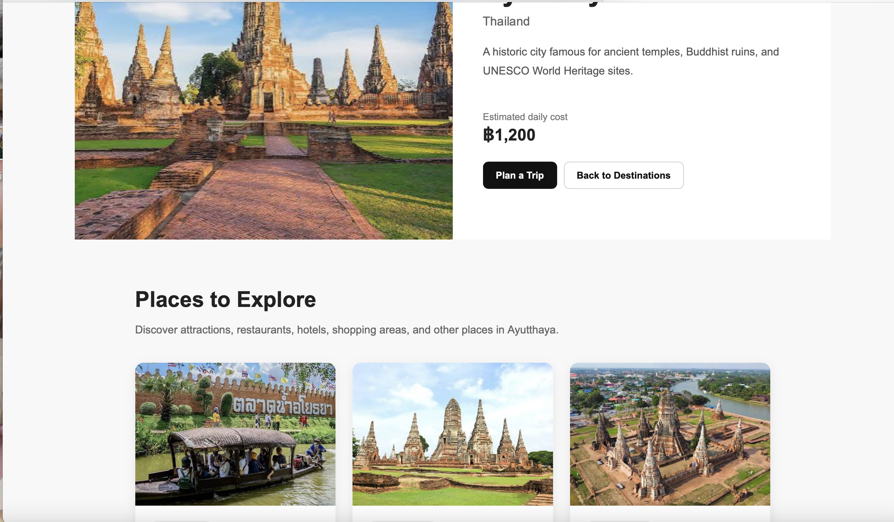
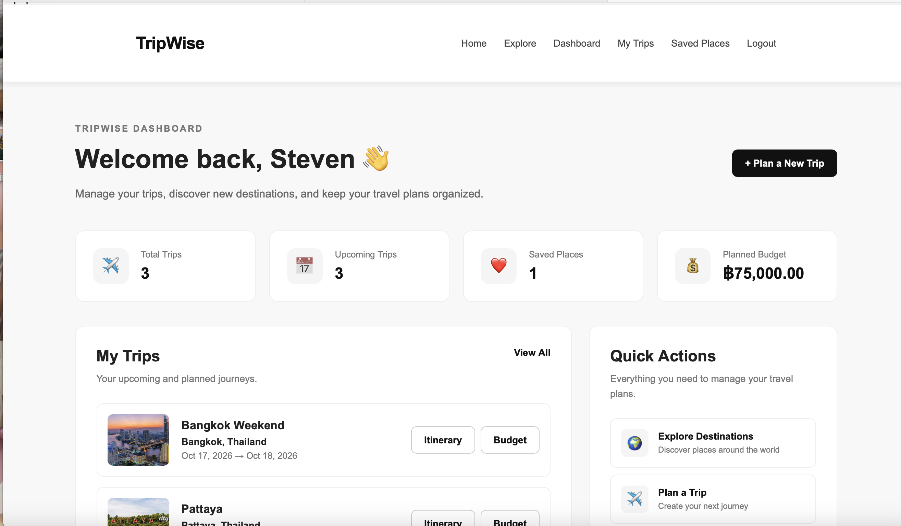
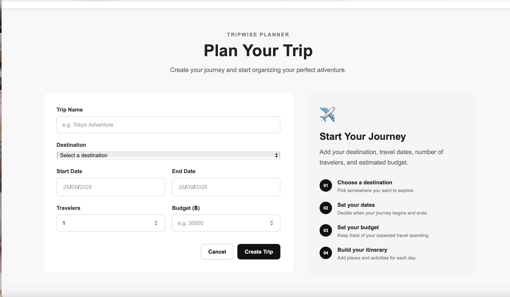
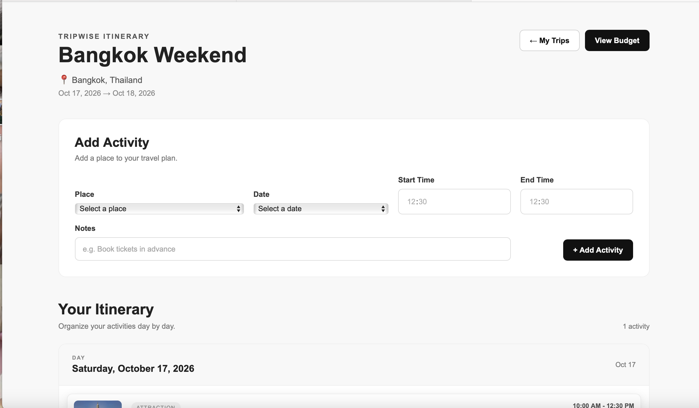
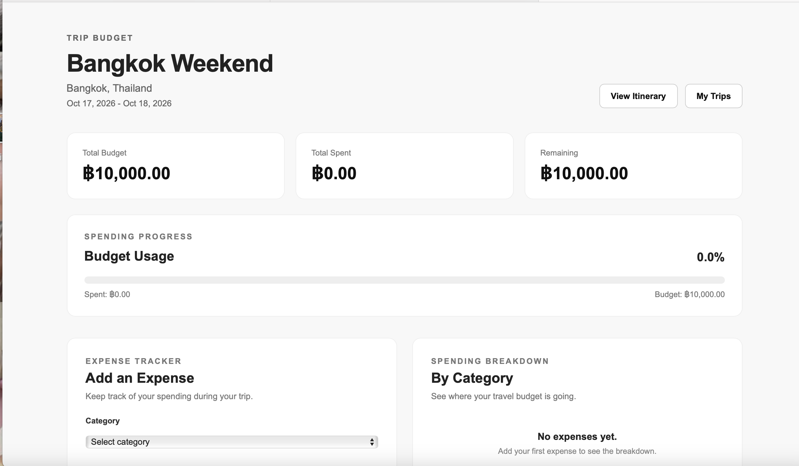
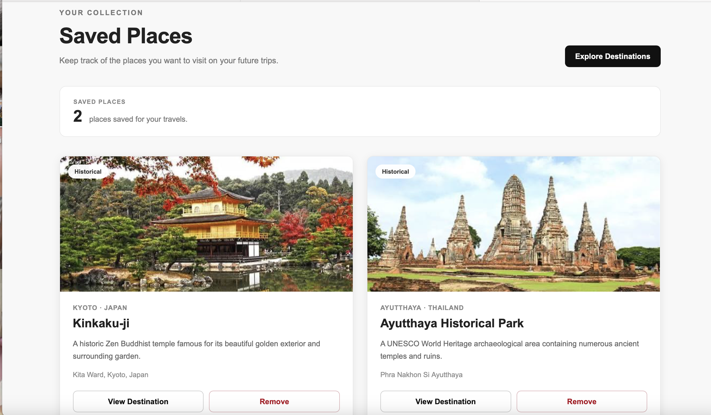
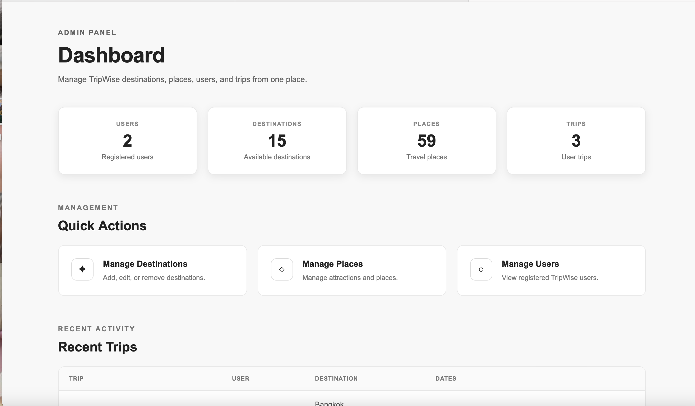
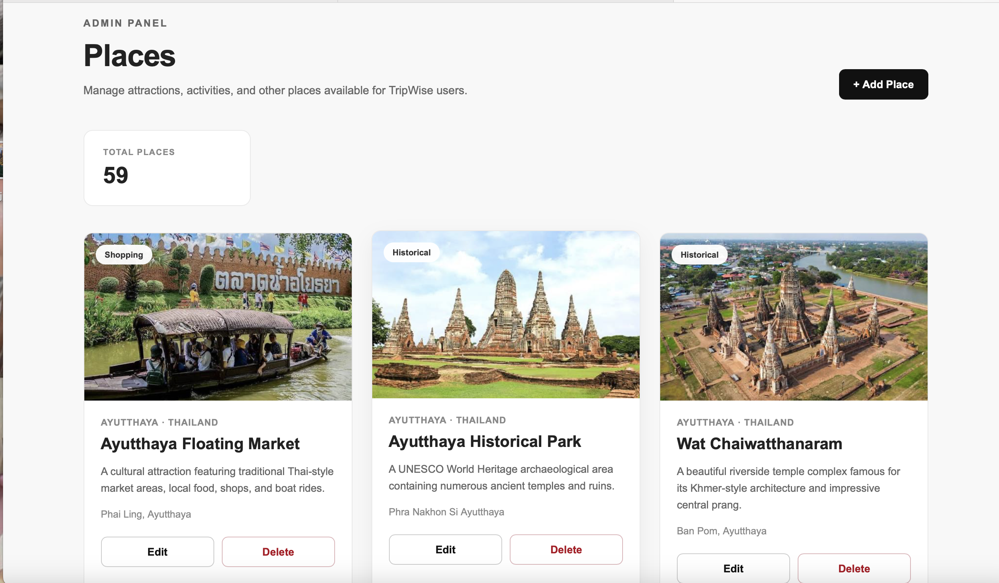

# TripWise — Travel Planning Web Application

TripWise is a full-stack travel planning web application designed to help users discover destinations, explore places, create personalized trips, build itineraries, manage travel budgets, and save favorite places.

The application also includes an administrative dashboard for managing destinations, places, and users.

---

## Features

### User Features

* User registration and login
* Browse Thailand and international destinations
* Explore destination details and places
* Create and manage travel plans
* Build day-by-day itineraries
* Track trip budgets and expenses
* Save favorite places
* View personal trip information through a dashboard
* Responsive design for desktop and mobile screens

### Admin Features

* Admin dashboard
* Manage destinations
* Add, edit, and delete destinations
* Manage places
* Add, edit, and delete places
* View registered users
* Role-based access control

---

## Technologies

* HTML5
* CSS3
* JavaScript
* PHP
* MySQL
* PDO
* XAMPP
* phpMyAdmin
* Git & GitHub

---

## Key Technical Concepts

* CRUD operations
* Session-based authentication
* Role-based authorization
* MySQL relational database design
* Foreign key relationships
* PDO prepared statements
* Server-side form validation
* User ownership checks
* Responsive web design
* Secure output using `htmlspecialchars()`

---

## Database Structure

TripWise uses a relational MySQL database containing the following tables:

```text
users
destinations
places
trips
itineraries
expenses
saved_places
```

### Main Relationships

```text
Users
 ├── Trips
 │    ├── Itineraries
 │    └── Expenses
 │
 └── Saved Places

Destinations
 ├── Places
 └── Trips
```

Foreign key relationships are used to maintain data integrity between related records.

---

## Project Structure

```text
tripwise-travel-planner/
│
├── index.php
├── destinations.php
├── destination-details.php
├── login.php
├── register.php
├── logout.php
├── dashboard.php
├── my-trips.php
├── create-trip.php
├── edit-trip.php
├── delete-trip.php
├── itinerary.php
├── budget.php
├── saved-places.php
├── save-place.php
├── remove-saved-place.php
│
├── config/
│   └── database.php
│
├── includes/
│   ├── header.php
│   ├── footer.php
│   ├── auth.php
│   └── admin-auth.php
│
├── admin/
│   ├── index.php
│   ├── destinations.php
│   ├── destination-form.php
│   ├── places.php
│   ├── place-form.php
│   └── users.php
│
├── css/
│   └── style.css
│
├── js/
│   └── script.js
│
└── images/
```

---

## Installation

### Requirements

Before running TripWise, install:

* XAMPP
* PHP
* MySQL
* phpMyAdmin
* A web browser
* A code editor such as Visual Studio Code

### 1. Clone the repository

```bash
git clone https://github.com/MayPhu2k/tripwise-travel-planner.git

### 2. Move the project

Place the project inside the XAMPP `htdocs` directory.

For example:

```text
htdocs/
└── travel-planner/
```

### 3. Create the database

Create a MySQL database named:

```text
travel_planner
```

Then create/import the required tables:

```text
users
destinations
places
trips
itineraries
expenses
saved_places
```

### 4. Configure the database

Update:

```text
config/database.php
```

with your local MySQL credentials.

Example:

```php
$host = "localhost";
$dbname = "travel_planner";
$username = "root";
$password = "";
```

### 5. Start XAMPP

Start:

```text
Apache
MySQL
```

### 6. Open TripWise

Visit:

```text
http://localhost/travel-planner/
```

---

## Security

TripWise uses several basic security practices, including:

* PDO prepared statements
* Password hashing
* Session-based authentication
* Role-based authorization
* User ownership checks
* Server-side validation
* HTML output escaping

Sensitive production credentials should not be committed to the repository.

---

## Project Status

**Completed**

Core travel planning functionality and the administrative system have been implemented.

Future improvements may include:

* Maps integration
* Weather API integration
* More advanced destination search
* Trip analytics
* Additional budget visualizations
* Online deployment

---

## Screenshots

### Home


### Destinations


### Destination Details


### Dashboard


### Create Trip


### Itinerary


### Budget


### Saved Places


### Admin Dashboard


### Admin Places


---

## Author

**May Phu Aung**

This project was developed as part of my portfolio and internship preparation to demonstrate full-stack web development, PHP/MySQL development, database design, authentication, CRUD operations, and responsive UI development.
